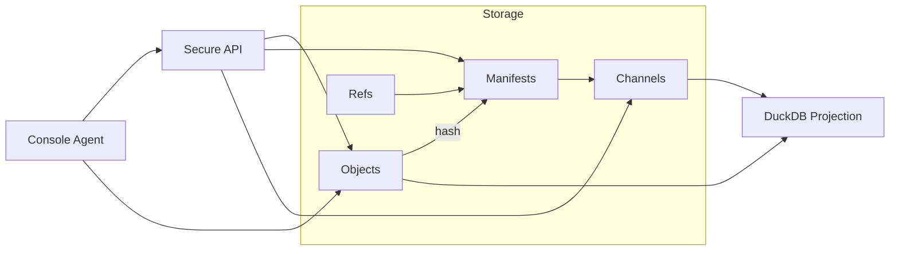

# BNX Link

**Content-addressed, manifest-driven data pipeline scaffold for agents, APIs, and reproducible datasets.**

BNX Link is an open-source scaffold for building agent-friendly, protocol-aligned data pipelines.

It provides:

- **Content-addressed storage**: Immutable JSON objects with SHA-256 integrity.
- **Manifests & Channels**: Group and promote objects between environments (dev → staging → prod).
- **Audit Ledger**: Append-only log of all writes, promotions, and API accesses.
- **DuckDB Projection**: Query structured views of your objects locally.
- **Secure API**: JWT-based auth, scopes, and purpose-based access control.
- **Agent CLI**: Summarize and interact with your dataset directly from the console.

BNX Link is *domain-agnostic* — you define your own object types with JSON Schemas.

---

## Quickstart

### Requirements
- Python 3.11+
- `make`
- Optional: DuckDB CLI for ad-hoc SQL queries

### Install
```bash
git clone https://github.com/bnxlink/bnxlink.git
cd bnxlink
make venv install
```

### Run the demo
```bash
make demo

# In one terminal:
make api

# In another:
make token
make agent
```

### Docker Quickstart
```bash
# Build and run
docker build -t bnxlink:0.1.0 .
docker run --rm -p 8000:8000 --env-file .env bnxlink:0.1.0

# Or with custom environment
docker run --rm -p 8000:8000 \
  -e BNX_JWT_ALGORITHM=HS256 \
  -e BNX_JWT_SECRET=your-secret \
  bnxlink:0.1.0
```

---

## Core Concepts

- **Objects**: Immutable JSON files, hashed by SHA-256 and stored under `data/objects/`.
- **Refs**: Human-friendly pointers (`data/refs/`) mapping logical IDs + dates to object hashes.
- **Manifests**: Snapshots of object sets, each with its own integrity hash.
- **Channels**: Pointers to manifests for environments (`core.prod`, `core.staging`).
- **Ledger**: Append-only audit log (`data/ledger.ndjson`).

---

## Architecture



See [docs/architecture.md](docs/architecture.md) for more detail.

---

## API

Built with FastAPI.

**Auth**: JWT Bearer tokens with environment-configurable algorithms:
- `HS256` for development (default)
- `RS256` for production with PEM keys

**Scopes**:
- `objects:read` → Full object access
- `objects:read:redacted` → Limited to `llm_min` view only
- `manifests:read` → Access to manifest data
- `channels:promote` → Promote manifests between channels

**Redaction Gating**: Users with only `objects:read:redacted` scope cannot request full views.

**Error Format**: Consistent error responses with codes and messages:
```json
{"error": {"code": "forbidden", "message": "Missing scope: objects:read"}}
```

Example:
```bash
curl -H "Authorization: Bearer $TOKEN" \
  "http://localhost:8000/objects/sha256:1234...?view=llm_min"
```

**Endpoints**:
- `/health` — Health check
- `/docs` — Interactive API documentation
- `/metrics` — Prometheus metrics
- `/objects/{hash}` — Get objects with ETag caching
- `/manifests/{dataset}/{id}` — Get manifests
- `/channels/{dataset}/{channel}:promote` — Promote manifests

**Promotion API**:
The promotion endpoint accepts either a manifest ID (string) or full manifest object (dict):

```bash
# Promote by ID (existing manifest file)
curl -X POST "http://localhost:8000/channels/core/prod:promote" \
  -H "Authorization: Bearer $TOKEN" \
  -H "Content-Type: application/json" \
  -d '{"manifest": "dev-seed"}'

# Promote with full manifest (creates snapshot if needed)
curl -X POST "http://localhost:8000/channels/core/prod:promote" \
  -H "Authorization: Bearer $TOKEN" \
  -H "Content-Type: application/json" \
  -d '{"manifest": {"manifest_id": "new-release", ...}}'
```

**Channels Storage Format**:
Channels are stored in normalized format under `data/channels.yaml`:

```yaml
core:
  prod:
    current:
      id: dev-seed
      etag: sha256:dev-seed1234567890abcdef
      promoted_at: 2025-08-10T14:32:20.579467Z
      by: test-user
    history:
      - id: previous-release
        etag: sha256:previous1234567890abcdef
        promoted_at: 2025-08-10T12:00:00Z
        by: test-user
```

---

## Agent CLI

Run:
```bash
make agent
```

Commands:
- `list` — List loaded objects.
- `show <n>` — Show JSON for object n.
- `quit` — Exit the REPL.

The agent applies a summarizer pipe by default, producing a context overview suitable for AI ingestion.

---

## Development

### Common tasks
```bash
make objects       # hash and store sample objects
make manifest      # build manifest
make promote       # promote manifest to staging/prod
make validate      # validate repo (schema + hash check)
make db            # rebuild DuckDB projection
make agent         # run console agent
```

### Run tests
```bash
pytest -q
```

---

## Security

**Important**: The default JWT secret (`dev-only-not-for-prod`) is for development only. In production:

1. Set `BNX_JWT_ALGORITHM=RS256`
2. Provide `BNX_JWT_PUBLIC_KEY` and `BNX_JWT_PRIVATE_KEY` as PEM files
3. Use strong, unique secrets for `BNX_JWT_SECRET` if staying with HS256
4. Configure `BNX_CORS_ORIGINS` to restrict cross-origin requests

See [SECURITY.md](SECURITY.md) for more details.

## Contributing

We welcome contributions! See [CONTRIBUTING.md](CONTRIBUTING.md) for details.

---

## License

Apache-2.0 — see [LICENSE](LICENSE).

---

## Links

- [Architecture](docs/architecture.md)
- [Data Model](docs/data-model.md)
- [Roadmap](docs/roadmap.md)
- [Security Model](docs/security.md)
