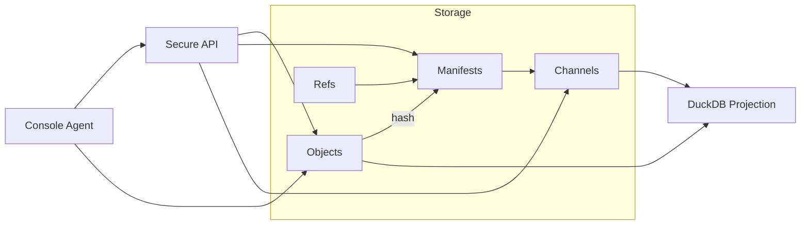

# BNX Link

**Content-addressed, manifest-driven data pipeline scaffold for agents, APIs, and reproducible datasets.**

BNX Link is an open-source scaffold for building agent-friendly, protocol-aligned data pipelines.

It provides:

- **Content-addressed storage**: Immutable JSON objects with SHA-256 integrity.
- **Manifests & Channels**: Group and promote objects between environments (dev → staging → prod).
- **Audit Ledger**: Append-only log of all writes, promotions, and API accesses.
- **DuckDB Projection**: Query structured views of your objects locally.
- **Secure API**: JWT-based auth, scopes, and purpose-based access control.
- **Agent CLI**: Summarize and interact with your dataset directly from the console.

BNX Link is *domain-agnostic* — you define your own object types with JSON Schemas.

---

## Quickstart

### Requirements
- Python 3.11+
- `make`
- Optional: DuckDB CLI for ad-hoc SQL queries

### Install
```bash
git clone https://github.com/bnxlink/bnxlink.git
cd bnxlink
make venv install
```

### Run the demo
```bash
make demo

# In one terminal:
make api

# In another:
make token
make agent
```

---

## Core Concepts

- **Objects**: Immutable JSON files, hashed by SHA-256 and stored under `data/objects/`.
- **Refs**: Human-friendly pointers (`data/refs/`) mapping logical IDs + dates to object hashes.
- **Manifests**: Snapshots of object sets, each with its own integrity hash.
- **Channels**: Pointers to manifests for environments (`core.prod`, `core.staging`).
- **Ledger**: Append-only audit log (`data/ledger.ndjson`).

---

## Architecture



See [docs/architecture.md](docs/architecture.md) for more detail.

---

## API

Built with FastAPI.

**Auth**: JWT Bearer tokens (HS256 for dev; RS256 planned for production).

**Scopes**:
- `objects:read`
- `objects:read:redacted`
- `manifests:read`
- `manifests:write`
- `channels:promote`

Example:
```bash
curl -H "Authorization: Bearer $TOKEN" \
  "http://localhost:8000/objects/sha256:1234...?view=llm_min"
```

---

## Agent CLI

Run:
```bash
make agent
```

Commands:
- `list` — List loaded objects.
- `show <n>` — Show JSON for object n.
- `quit` — Exit the REPL.

The agent applies a summarizer pipe by default, producing a context overview suitable for AI ingestion.

---

## Development

### Common tasks
```bash
make objects       # hash and store sample objects
make manifest      # build manifest
make promote       # promote manifest to staging/prod
make validate      # validate repo (schema + hash check)
make db            # rebuild DuckDB projection
make agent         # run console agent
```

### Run tests
```bash
pytest -q
```

---

## Contributing

We welcome contributions! See [CONTRIBUTING.md](CONTRIBUTING.md) for details.

---

## License

Apache-2.0 — see [LICENSE](LICENSE).

---

## Links

- [Architecture](docs/architecture.md)
- [Data Model](docs/data-model.md)
- [Roadmap](docs/roadmap.md)
- [Security Model](docs/security.md)
